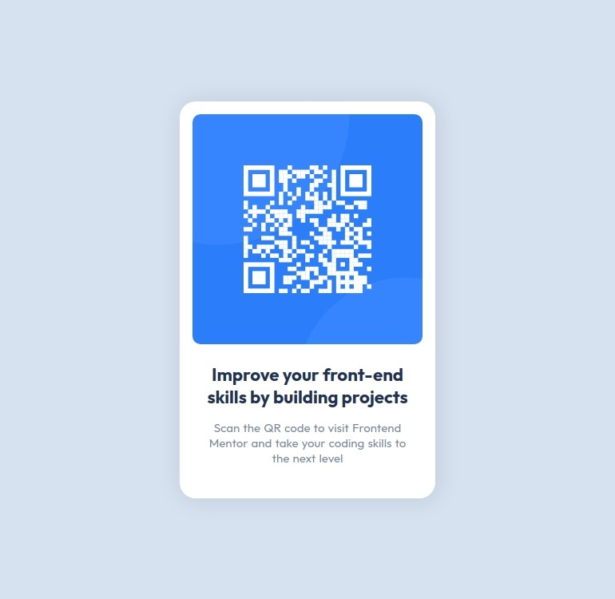

# QR component

Challenge from [Frontend Mentor](https://www.frontendmentor.io/)

## Screenshots 📸

- ### 🖥️ Desktop version
  

## Links 🔗

- Repo: [Github](https://github.com/RicAlc/Portfolio/tree/main/Front-end/QRcomponent)
- Site URL: [site](https://ricalc.github.io/Portfolio/Front-end/QRcomponent/qr-component.html)

## Built with 🧰 🛠️

- HTML5
- CSS custom properties
- Flexbox
- Saas

## Author 🧑🏽‍💻

- Github - [Ricardo Alcalá](https://www.github.com/RicAlc)
- Twitter - [@\_RicAlc](https://twitter.com/_RicAlc)
