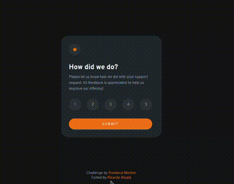
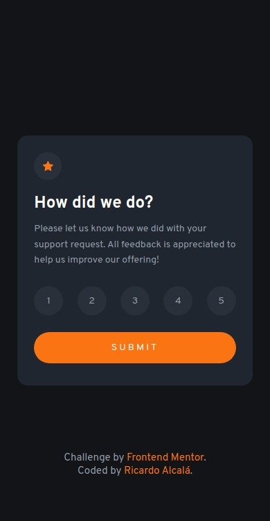

# Rating component

Challenge from [Frontend Mentor](https://www.frontendmentor.io/)

## The challenge ✅

Users should be able to:

- Select and submit a number rating
- See the "Thank you" card state after submitting a rating
- View the optimal layout for the app depending on their device's screen size
- See hover states for all interactive elements on the page

## Screenshots 📸

- ### 🖥️ Desktop version
  
- ### 📱 Mobile version
  

## Links 🔗

- Repo: [Github](https://github.com/RicAlc/Portfolio/tree/main/Front-end/RatingComponent)
- Site URL: [site](https://ricalc.github.io/Portfolio/Front-end/RatingComponent/rating-component.html)

## Built with 🧰 🛠️

- HTML5
- CSS custom properties
- JavaScript
- Flexbox
- Saas
- Media queries

## Author 🧑🏽‍💻

- Github - [Ricardo Alcalá](https://www.github.com/RicAlc)
- Twitter - [@\_RicAlc](https://twitter.com/_RicAlc)
