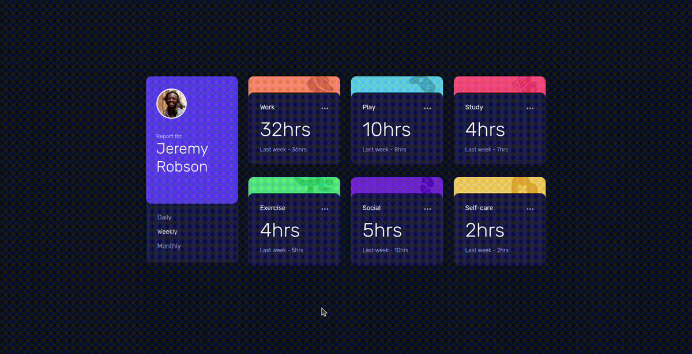
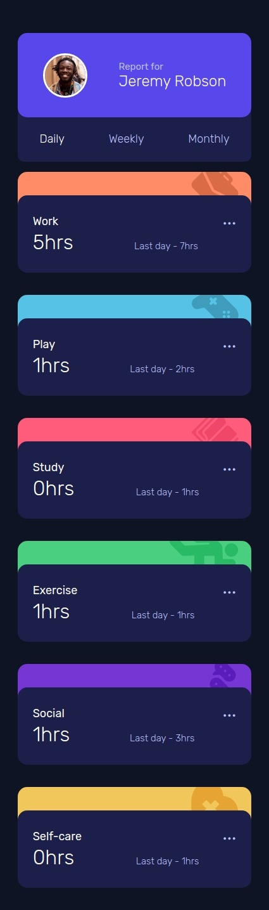

# Time tracking dashboard

This is a solution to the [Time tracking dashboard challenge on Frontend Mentor](https://www.frontendmentor.io/challenges/time-tracking-dashboard-UIQ7167Jw).

## The challenge ✅

Users should be able to:

- View the optimal layout for the site depending on their device's screen size
- See hover states for all interactive elements on the page
- Switch between viewing Daily, Weekly, and Monthly stats

## Screenshots 📸

- ### 🖥️ Desktop version
  
- ### 📱 Mobile version
  

## Links 🔗

- Repo: [Github](https://github.com/RicAlc/Portfolio/tree/main/Front-end/TimeTrackingDashboard)
- Site URL: [site](https://ricalc.github.io/Portfolio/Front-end/TimeTrackingDashboard/index.html)

## Built with 🧰 🛠️

- HTML5
- JavaScript
- CSS custom properties
- Flexbox
- CSS Grid
- Saas

## Author 🧑🏽‍💻

- Github - [Ricardo Alcalá](https://www.github.com/RicAlc)
- Twitter - [@\_RicAlc](https://twitter.com/_RicAlc)
